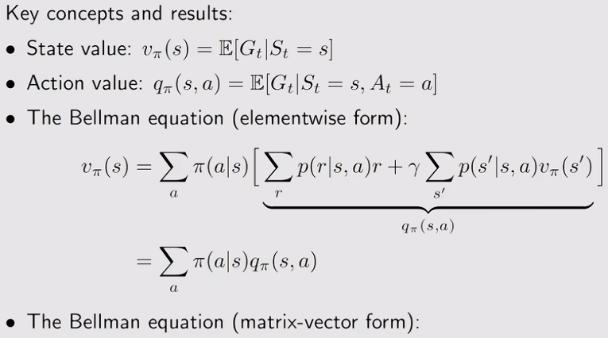

## 一、基础概念
- State
- Action
- State transition
- Policy
- Reward
- Trajectory
- discount rate：Gt
- episode, terminal states
- MDP(S,A,P,R,r):memoryless property
1.啥是MDP?
- M:历史无关性
- D:决定，就是策列，就是强化学习的最终目标，应该说是最优策略
- P:根据五元组，和状态转移概率和奖励概率分步，求取最优策略的过程
2.return和reward的区别？
- reward:是执行动作后环境立即返回的单步奖励
- return:可以评估策略好坏，是根据策略执该行动作后未来reward的期望
- 前者：单步，即时；后者：累计，多步，一般是有折扣的

## 贝尔曼公式
state value：$$v_\pi(s) = \mathbb{E}[G_t \mid S_t = s]$$

1.state value和return的区别？
return是对单个trajectory求得，state value是对所有trajectory求得return的平均值
