---

### 1. 试错学习（Trial and Error）
这是 RL 与监督学习最大的不同。
*   **监督学习：** 老师告诉你这张图是猫，那张图是狗。
*   **强化学习：** 没有老师告诉你正确答案。智能体（Agent）必须**亲自下场去试**。
    *   尝试 A 动作，被打了一顿（负奖励）；
    *   尝试 B 动作，得到了糖果（正奖励）。
*   **核心逻辑：** 好的动作被“强化”（出现的概率增加），坏的动作被“惩罚”（出现的概率减少）。

### 2. 探索与利用的权衡（Exploration vs. Exploitation）
这是 RL 中最经典的矛盾，就像人生选择：
*   **利用（Exploitation）：** 去吃你最喜欢的那家餐馆。风险低，收益稳，但你可能永远错过更好吃的。
*   **探索（Exploration）：** 尝试一家从未去过的新餐馆。风险高（可能很难吃），但可能发现“人间美味”。
*   **核心思想：** 智能体不能一直贪婪地选择当前看起来最好的（容易陷入局部最优），必须拿出一定的概率去冒险尝试未知的领域。

### 3. 延迟奖励与信用分配（Delayed Reward & Credit Assignment）
这是 RL 最难也最迷人的地方。
*   **例子：** 下象棋。你在第 10 步走了一步妙手，但直到第 100 步你才赢了比赛。
*   **问题：** 到底是谁的功劳？是第 100 步的将军，还是第 10 步的伏笔？
*   **核心思想：** RL 通过**价值函数（Value Function）**，把最后的胜利（远期奖励）一步步地倒推回前面的每一步。这就是你之前问的 $v(s)$ 和 $v(s')$ 迭代的本质——**让前面的步骤也能感受到未来的光芒。**

### 4. 这里的“自举”思想（Bootstrapping）
这是你刚才看到的那个迭代公式的核心。
*   **思想：** **“用猜想来更新猜想。”**
*   在计算 $v_{k+1}(s)$ 时，我们用到了 $v_k(s')$。虽然 $v_k(s')$ 此时也是一个不准确的估计值，但我们依然敢用它。
*   **核心逻辑：** 只要我们不断根据环境反馈的真实奖励 $r$ 进行微调，这些“猜想”最终会像拼图一样，自己拼成一个客观真实的真理。

### 5. 环境的马尔可夫性（Markov Property）
这是所有 RL 算法的假设前提。
*   **思想：** **“未来只取决于现在，而与过去无关。”**
*   只要现在的状态 $s$ 包含的信息足够多，你就不需要翻看历史记录。
*   **核心逻辑：** 这简化了问题，让我们可以写出 $v(s) = r + \gamma v(s')$ 这种精简的公式，而不需要写成 $v(s_t, s_{t-1}, s_{t-2} \dots)$ 这种又臭又长的公式。

### 总结：强化学习在干什么？

强化学习的核心目标就是：**通过不断的试错，在“探索”新可能与“利用”旧经验之间寻找平衡，最终学会一套“策略（Policy）”，使得在长期的过程中获得的“总奖励”最大。**

---

## 一、基础概念
- State
- Action
- State transition
- Policy
- Reward
- Trajectory
- discount rate：Gt
- episode, terminal states
- MDP(S,A,P,R,r):memoryless property
1.啥是MDP?
- M:历史无关性
- D:决定，就是策列，就是强化学习的最终目标，应该说是最优策略
- P:根据五元组，和状态转移概率和奖励概率分步，求取最优策略的过程
2.return和reward的区别？
- reward:是执行动作后环境立即返回的单步奖励
- return:可以评估策略好坏，是根据策略执该行动作后未来reward的期望
- 前者：单步，即时；后者：累计，多步，一般是有折扣的
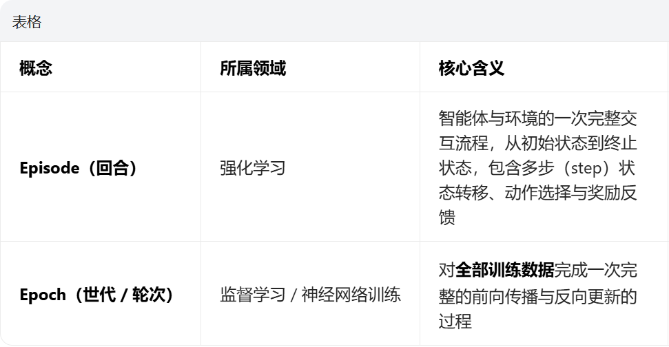
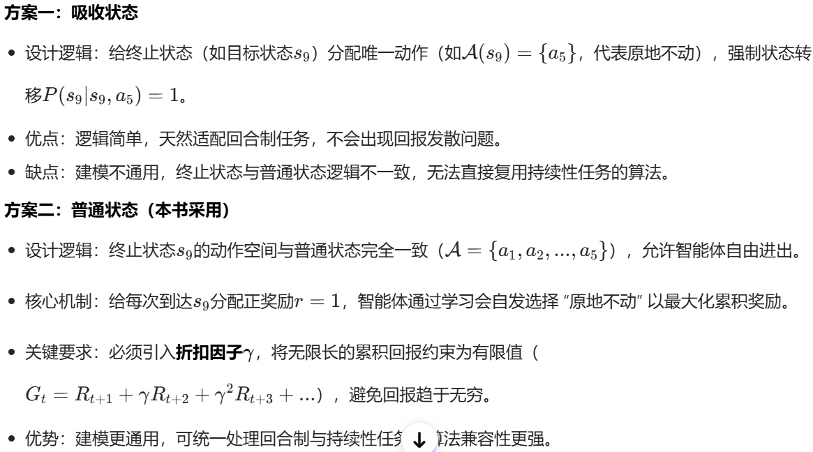

## 贝尔曼公式
state value：$$v_\pi(s) = \mathbb{E}[G_t \mid S_t = s]$$

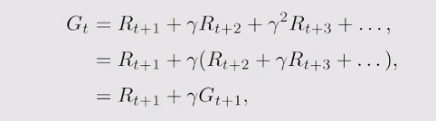
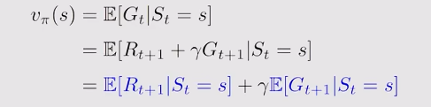
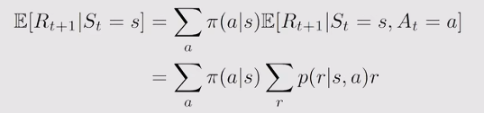
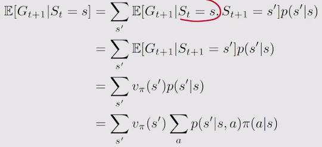
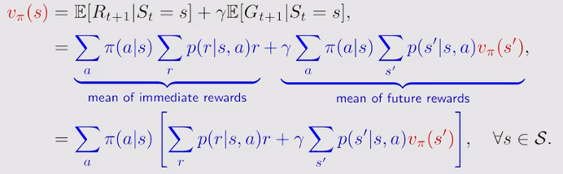
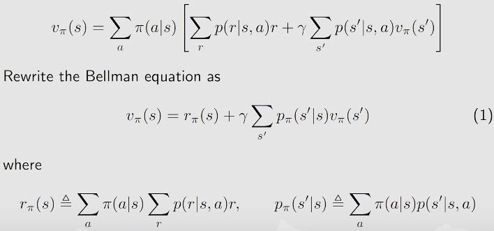
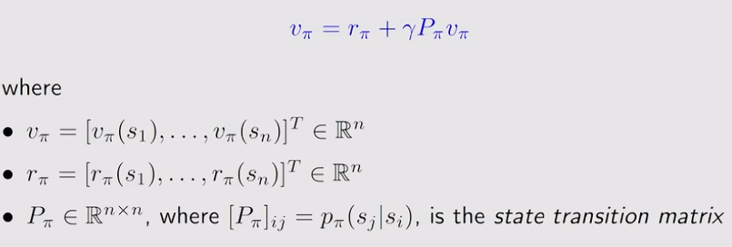
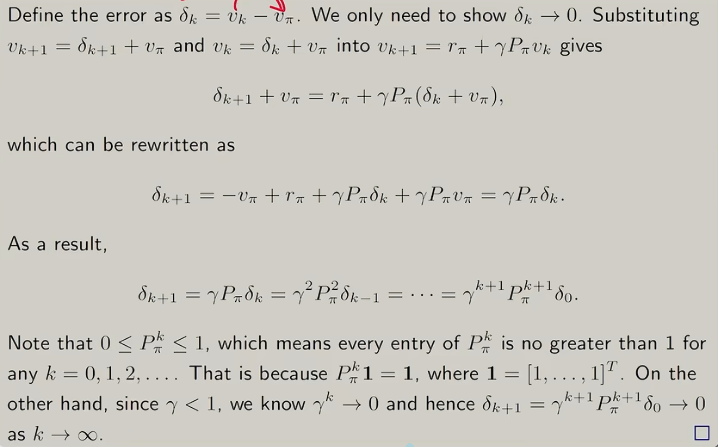
### 证明
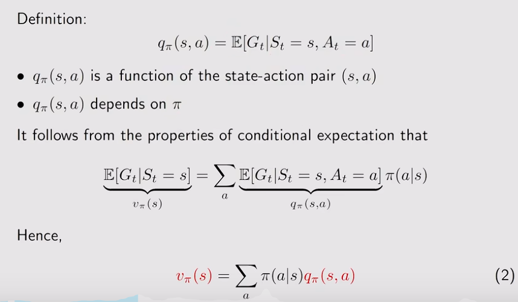
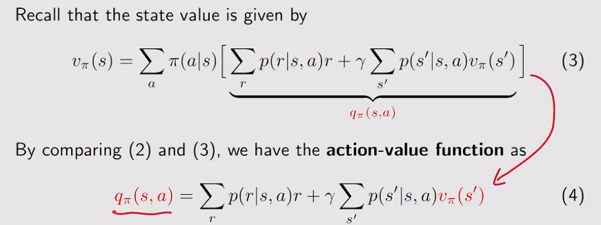
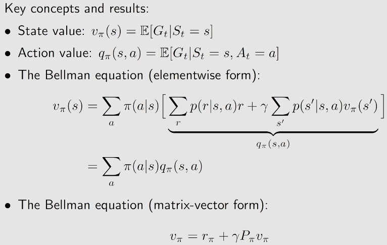
1.state value和return的区别？
return是对单个trajectory求得，state value是对所有trajectory求得return的平均值

## 贝尔曼最优公式
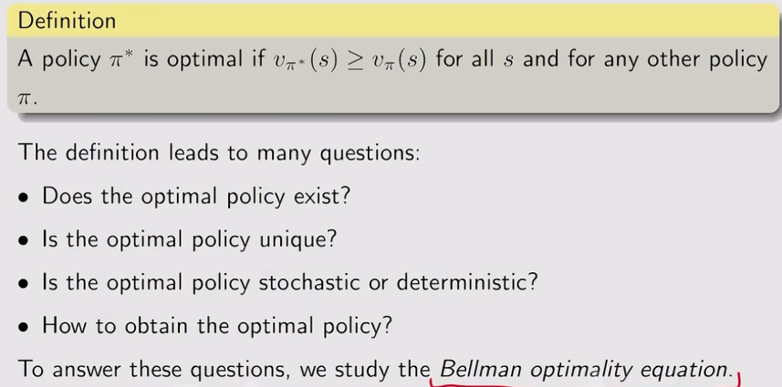
### 证明
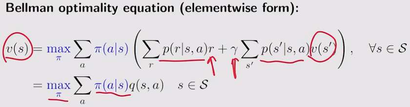
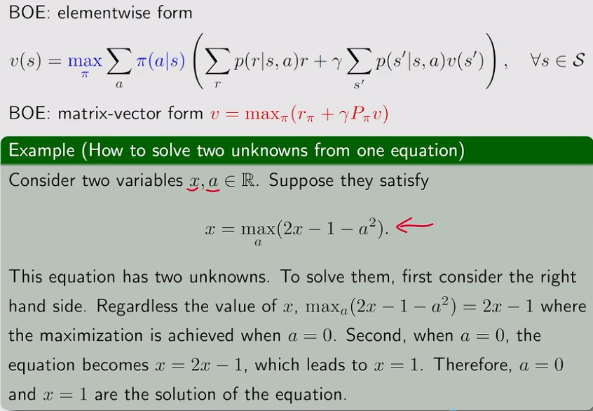
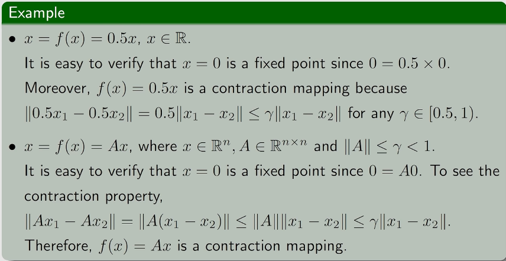
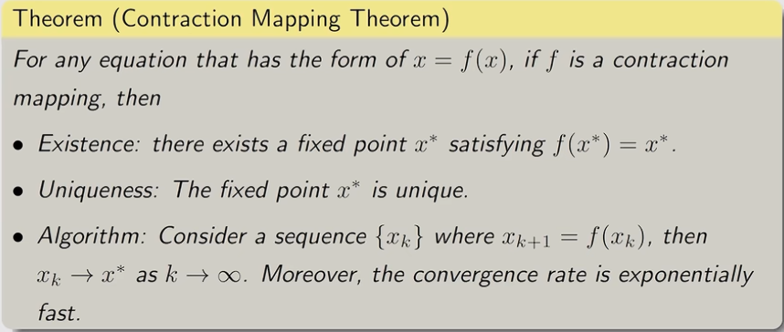
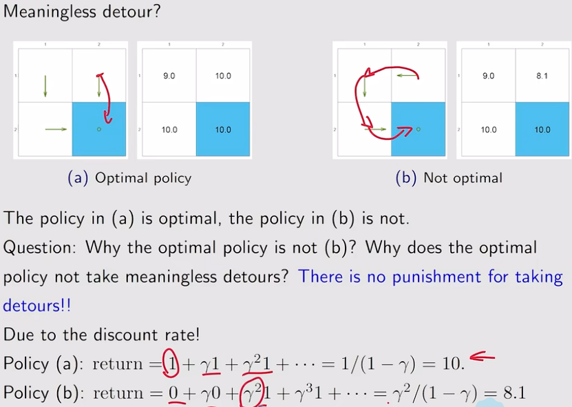
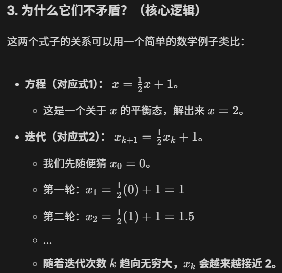
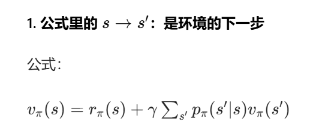
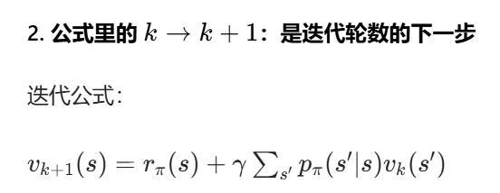
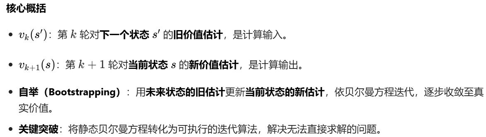