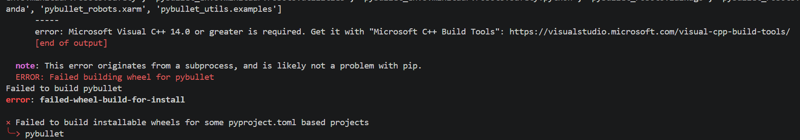

32G显存可是我只有8G(4060)

(rl) PS D:\rl\second> & C:\Users\lzy\anaconda3\envs\rl\python.exe d:/rl/second/train-8G.py
pybullet build time: Oct 21 2025 12:15:52
argv[0]=--background_color_red=0.8745098114013672
argv[1]=--background_color_green=0.21176470816135406
argv[2]=--background_color_blue=0.1764705926179886
🚀 4060 复现版启动 | 任务: PandaPickAndPlace-v3 | 设备: cuda
Ep:     0 | Rew: -50.0 | Suc: 0.00 | Alpha: 0.200 | Steps: 50
OMP: Error #15: Initializing libomp.dll, but found libiomp5md.dll already initialized.
OMP: Hint This means that multiple copies of the OpenMP runtime have been linked into the program. That is dangerous, since it can degrade performance or cause incorrect results. The best thing to do is to ensure that only a single OpenMP runtime is linked into the process, e.g. by avoiding static linking of the OpenMP runtime in any library. As an unsafe, unsupported, undocumented workaround you can set the environment variable KMP_DUPLICATE_LIB_OK=TRUE to allow the program to continue to execute, but that may cause crashes or silently produce incorrect results. For more information, please see http://openmp.llvm.org/